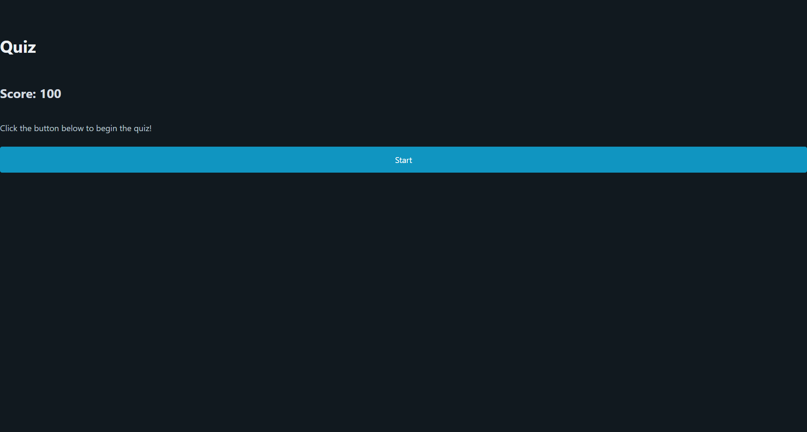

# coding-quiz

## Description

This is a quiz with a 99 second timer. the timer will drop an additional 15 seconds if you get a question wrong. At the end of the quiz the timer will stop and you can enter your initials to log your high score. This portion of the application is still in development.

## Screenshots

## Live Site

